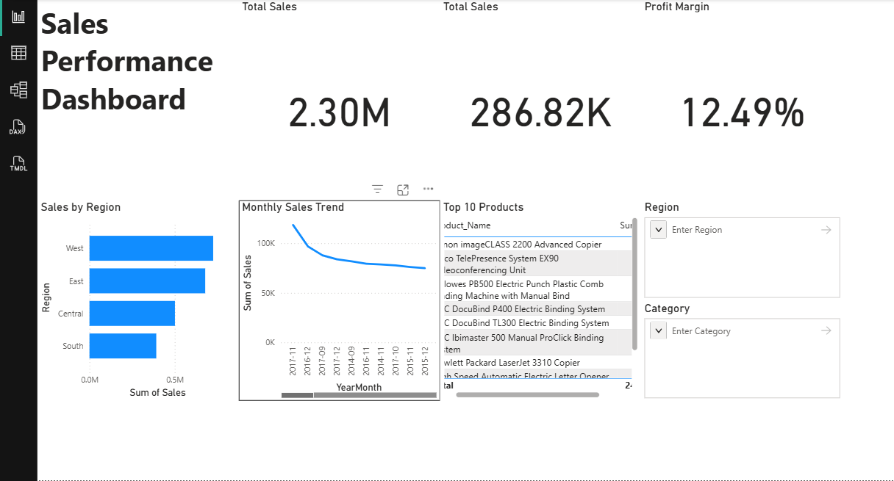

# Sales Performance Dashboard

## Project Overview

This project analyzes retail sales data using SQL Server and Power BI.  
The goal is to track sales performance, identify profitable regions, and determine top performing products using an interactive dashboard.

## Tools Used

- SQL Server
- SQL
- Power BI

## Key Metrics

- Total Sales
- Total Profit
- Profit Margin

## Dashboard Visualizations

- Sales by Region (Bar Chart)
- Monthly Sales Trend (Line Chart)
- Top 10 Products by Sales (Table)
- KPI Cards for Sales, Profit, and Profit Margin

## Key Insights

- The **West region generates the highest sales revenue**.
- **Technology products contribute significantly to overall profit**.
- Sales fluctuate across months, indicating **seasonal demand patterns**.

## Repository Structure
